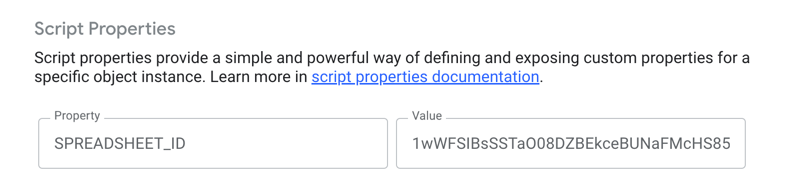
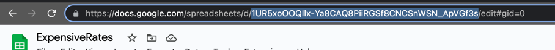
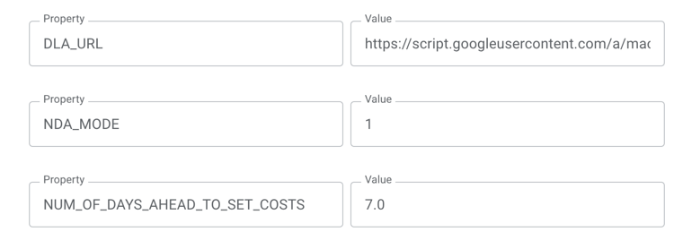

# ExpensiveMeets 😄📅💰

## Description
Welcome to ExpensiveMeets, a fun and handy Google App Script application that evaluates the cost of your meetings based on the participants' hourly rates! 💼💵

[Video Demo](https://www.loom.com/share/e32967da9b5b4d13a1c8651b19431c4b?sid=f71a4f34-8567-4411-83d2-f759d43647b6) 🎥🚀

## Architecture:
Expensive Meets uses Google App Script to create a web application that can be accessed via a URL. We use Google Spreadsheet as a data source for hourly rates of each worker. 🏢📊

### Backend
That spreadsheet is accessed only by a backend script that should be hosted separately from the service account with permission to a database spreadsheet. 🔐💾

That way we can ensure that the data is not exposed to the end user, and NDA info about salaries is protected. The backend script is located in the `./DAL/index.js` file. 🛠️🗄️

### Frontend
The main app script is located in the `./app/index.js` file. It also launches the HTML page as a view. 😎🚀

### HTML
The HTML page is located in the `./app/page.html` file. It's a simple GUI that allows us to call the `app/index.js` file functions to calculate the meeting cost. The styling is done via TailwindCSS and generated into CSS styles via [TailwindPlay](https://play.tailwindcss.com/). 🎨✨

## How to run
1. Create a new Google Spreadsheet. You can see the desired format in the `./exampleTable.pdf` file. 📝🆕

2. Host the DAL script as a web app. You can find the instructions [here](https://developers.google.com/apps-script/guides/web). Then adjust the `SPREADSHEET_ID` field in the form below to add the latest spreadsheet id.👇  You can find the Spreadsheet ID in the URL of the spreadsheet. It is the part between `/d/` and `/edit` in the URL:  🌐🔗

3. Host the App script as a web app. You can find the instructions [here](https://developers.google.com/apps-script/guides/web). Then adjust the `DLA_URL` field in the form below to add the latest DAL URL.. Optionally, you can also change the `NDA_MODE` param to 0 if you want to render the exact rates instead of the hidden ones with `$` signs. 💻⚙️💡

4. Set up whitelisted emails in the `app/page.html` file on that line:
```javascript
 var whiteListMails = ["yurii.pidlisnyi@eliftech.com"]
```
Open the web app hosted URL, authorize via your Google account, give the app permission to access your Google Calendar, and enjoy the fun of knowing the cost of your meetings! 🎉📆✨